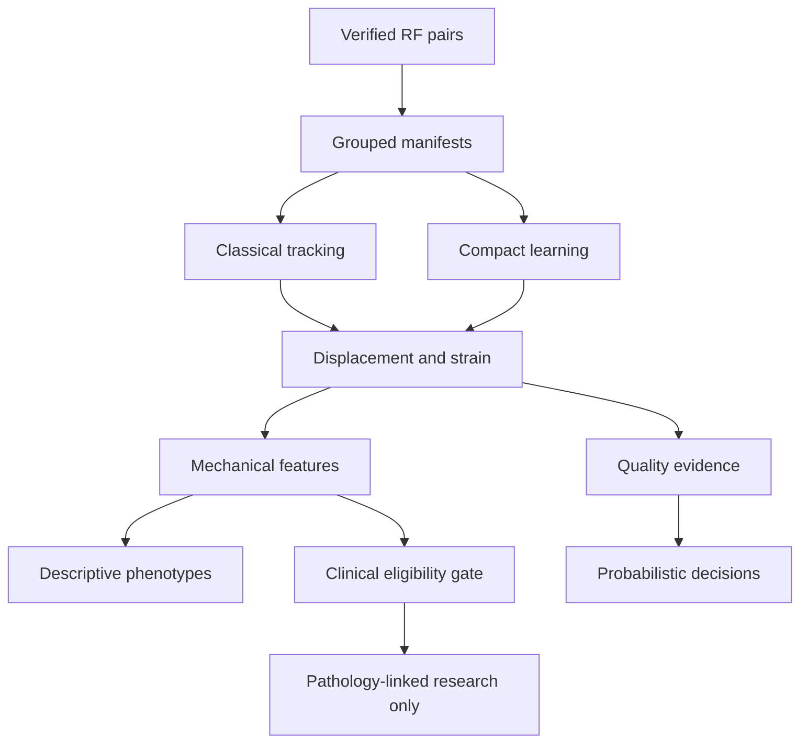
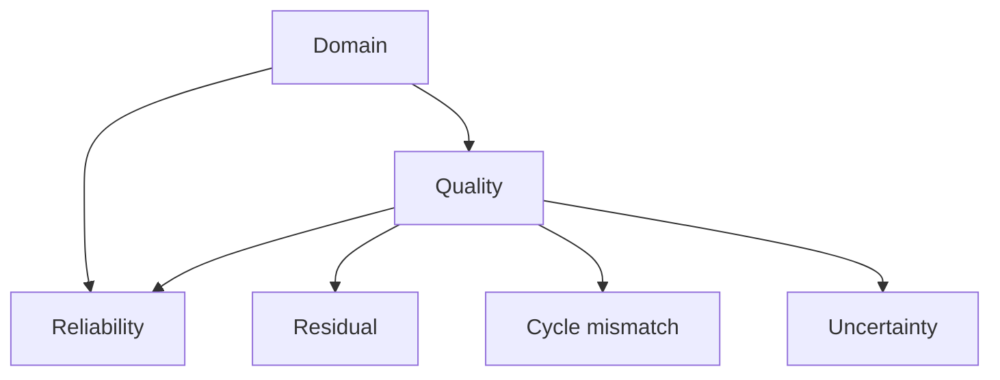

# Architecture

```mermaid
flowchart TD
  A[Verified RF pairs] --> B[Grouped manifests]
  B --> C[Classical tracking]
  B --> D[Compact learning]
  C --> E[Displacement and strain]
  D --> E
  E --> F[Mechanical features]
  E --> G[Quality evidence]
  F --> H[Descriptive phenotypes]
  G --> I[Probabilistic decisions]
  F --> J[Clinical eligibility gate]
  J --> K[Pathology-linked research only]
```

```mermaid
flowchart TD
  D[Domain] --> Q[Quality]
  D --> Y[Reliability]
  Q --> Y
  Q --> R[Residual]
  Q --> C[Cycle mismatch]
  Q --> U[Uncertainty]
```

All default BN parameters are illustrative assumptions. The graph is not a proven causal model.
